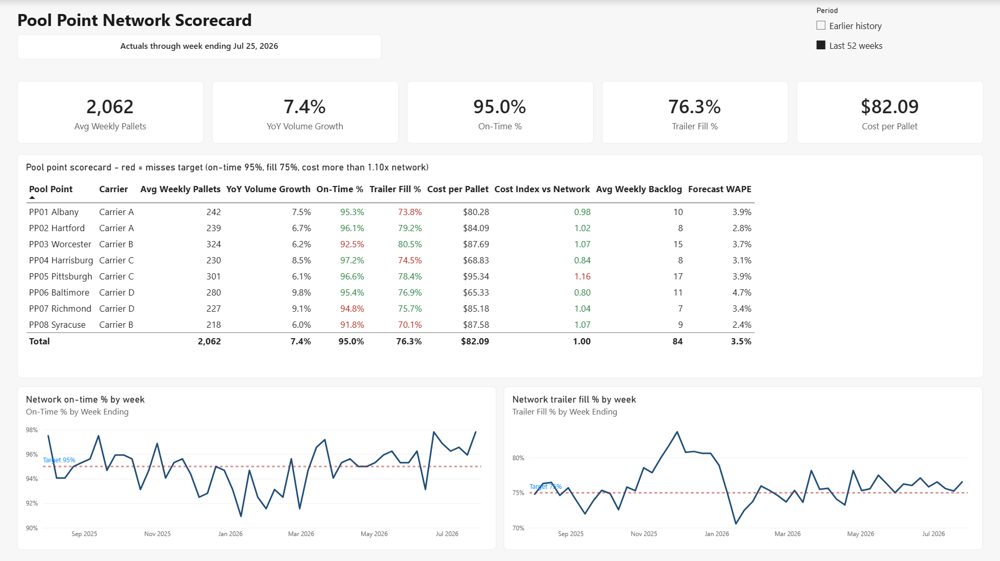
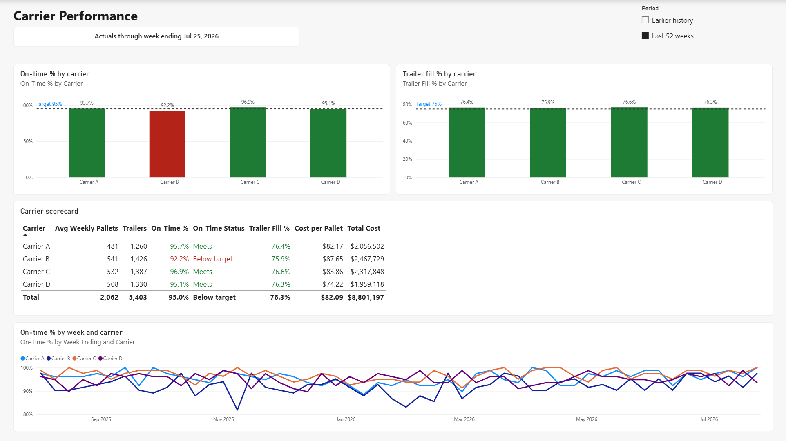
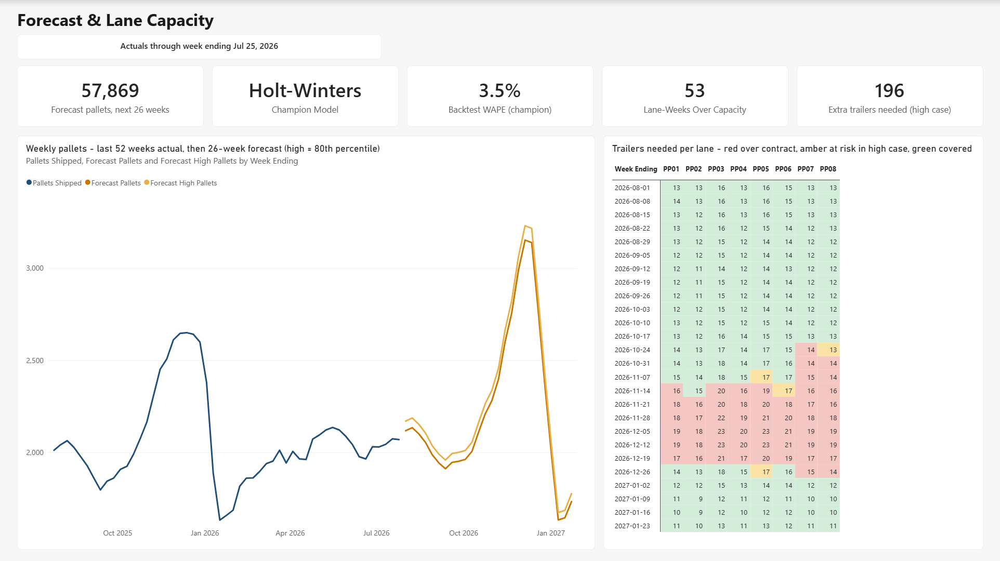
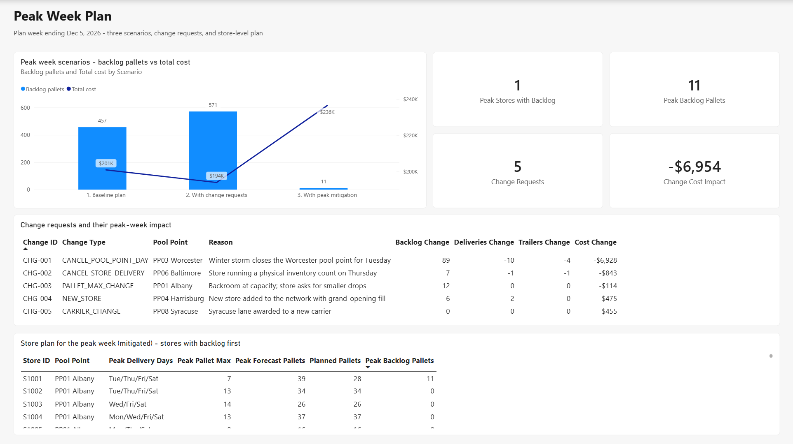
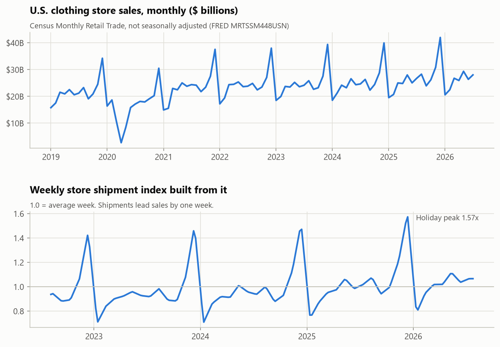
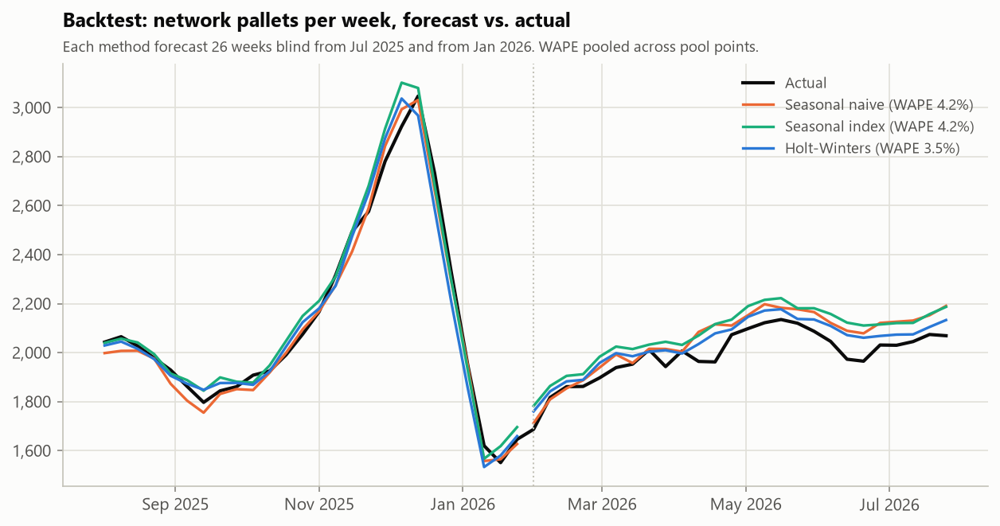
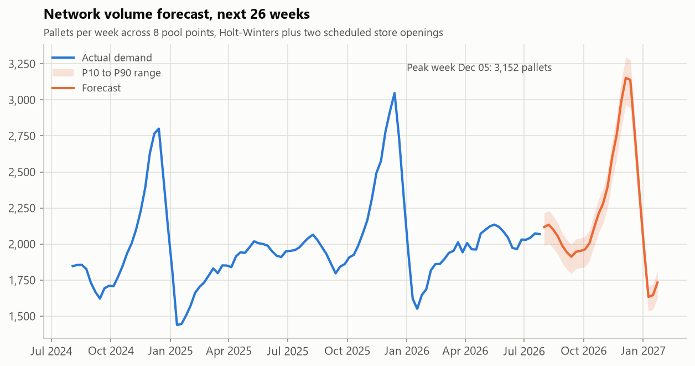
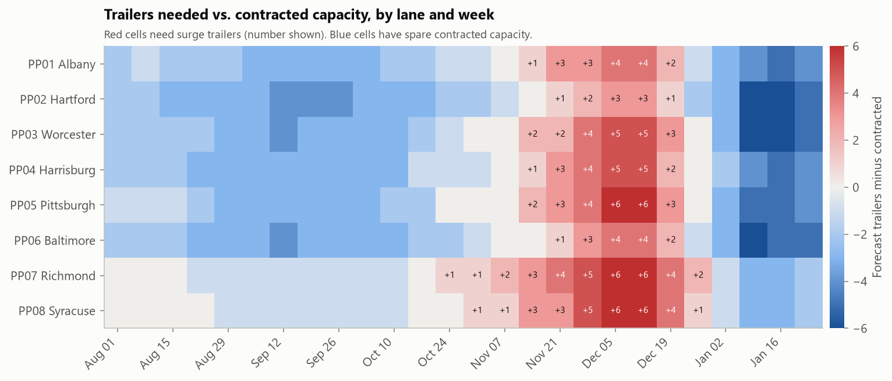
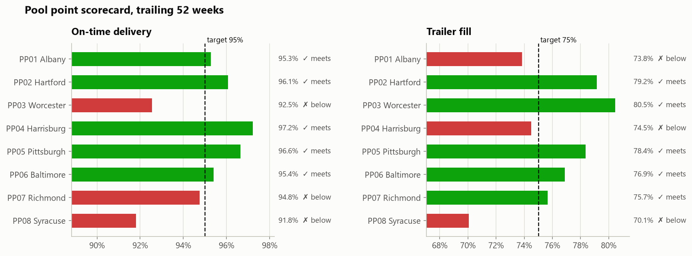
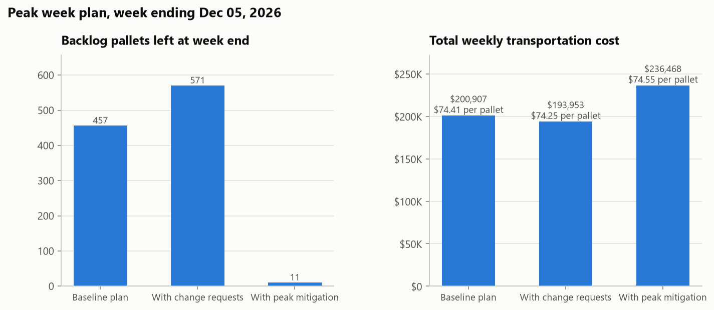

# Pool Point Network Planner
**Author:** Nana Afari  
**Tools:** Python (pandas, statsmodels, matplotlib, openpyxl) · Excel (XLOOKUP, SUMIFS, PivotTables, conditional formatting, data validation) · Power BI (Power Query, DAX, data modeling)  
**Data:** U.S. Census clothing store sales (real) driving a simulated retail outbound network

---

## Project Overview
Multi-store retailers ship from a distribution center (DC) to regional **pool points**, where freight is cross-docked onto local trucks for store delivery. This project builds the weekly planning workflow an outbound logistics analyst runs for that network:

1. **Forecast volume** by pool point for the next 26 weeks, and backtest three methods to choose one.
2. **Turn the forecast into trailers** and tell each carrier how much surge capacity to plan for.
3. **Plan the peak delivery week** store by store under pallet max limits, then apply real-world change requests: a pool point closure, a store cancellation, a pallet max change, a new store opening, and a carrier change.
4. **Report KPIs** (on-time delivery, trailer fill, cost per pallet, backlog) against targets.
5. **Package it in Excel** as a formula-driven operations report with a dashboard, store visibility report, backlog report, and PivotTables.
6. **Build a Power BI report** on the same data: a semantic model whose DAX measures match the Python scorecards exactly, and four report pages ([see below](#power-bi-report)).

The network has one DC, 8 pool points, 4 linehaul carriers, 136 stores (two of them opening this fall), and 208 weeks of history.

> **What's real and what's simulated.** Seasonality and trend come from real U.S. Census Monthly Retail Trade data for clothing stores ([FRED MRTSSM448USN](https://fred.stlouisfed.org/series/MRTSSM448USN)), through July 2026. Stores, carriers, rates, and service levels are simulated because real store-level shipment data is proprietary. Pool point cities and road miles are approximate.

---

## Key Findings
**Forecast**
- **Holt-Winters** won the backtest with **3.5% WAPE** at the pool point level, versus 4.2% for seasonal naive and seasonal index. Network-level WAPE was 2.3%.
- The next 26 weeks total **57,869 pallets, up 4.4%** on the same weeks last year. The peak week ends **Dec 5** at **3,152 pallets**.

**Carrier capacity**
- **53 of 208 lane-weeks** need more trailers than contracted, all between late October and late December.
- Carriers B and D need up to **12 extra trailers in a single week**. The outlook notes in `outputs/carrier_volume_outlook.md` are ready to send.

**KPI scorecard (trailing 52 weeks)**
- **Syracuse (PP08)** is the weakest lane, at 91.8% on-time and 70.1% trailer fill. Both are below target.
- Carrier B misses the 95% on-time target on both of its lanes.
- Pittsburgh (PP05) costs 16% more per pallet than the network average. It's the longest lane, at 300 miles.

**Peak week schedule**
- Standard pallet maxes leave **457 pallets undelivered at 133 stores**, about 14% of peak demand.
- Change requests add 114 more backlog pallets. The Worcester storm closure alone adds 89.
- The peak plan adds a delivery day and raises pallet max 25% for stores with backlog. It **clears 98% of backlog at a flat cost per pallet** ($74.55 vs. $74.25), and trailer fill rises from 79.7% to 85.9%.
- Moving Syracuse to Carrier D costs $36 more per trailer, for a carrier with 95.1% on-time versus 92.2%.

---

## Power BI Report
`powerbi/Pool-Point-Network.pbip` is a Power BI Desktop project built on the pipeline's CSVs.

| Network Scorecard | Carrier Performance |
|---|---|
|  |  |
| **Forecast & Capacity** | **Peak Week Plan** |
|  |  |

| Page | What it shows |
|---|---|
| Network Scorecard | KPI cards and a pool point scorecard for the selected period (trailing 52 weeks by default). Misses against target are red. Weekly on-time and trailer fill trends are drawn against target lines. |
| Carrier Performance | On-time and trailer fill by carrier against target, a carrier scorecard, and weekly on-time by carrier. |
| Forecast & Capacity | The last 52 weeks of actuals running into the 26-week forecast and its high case, and a lane-by-week heatmap of trailers needed versus contract. |
| Peak Week Plan | Backlog and total cost for the three peak-week scenarios, the five change requests and their impact, and the store-level plan. |

**Semantic model**
- **12 tables** loaded with Power Query from the project CSVs through one folder parameter. Relationships run Carriers → Pool Points → Stores, so a carrier filter reaches every table. A DAX date table splits weeks into earlier history, the last 52 weeks, and forecast.
- **57 DAX measures**, including on-time %, trailer fill %, cost per pallet, cost index vs. network, year-over-year growth (shifted 364 days so Saturday week-endings line up), average backlog, forecast and capacity measures, and status flags against each target.
- **Reconciled to the Python output.** Every scorecard value matches `outputs/kpi_scorecard.csv` (8 pool points × 15 KPIs) and `outputs/carrier_scorecard.csv` (4 carriers × 8 KPIs).
- **Measure-driven formatting.** Status colors and the capacity heatmap use the same rules as `kpis.py` and `capacity.py`.
- **Data gap handled in Power Query.** The new store from change request CHG-004 exists only in the change log, so the Stores query appends it.
- **Report as code.** `scripts/build_powerbi_pages.py` generates the four pages as PBIR files and validates them with Microsoft's `powerbi-report-author` CLI.

---

## Visuals
| | |
|---|---|
|  |  |
|  |  |
|  |  |

---

## Excel Operations Report
`outputs/pool_point_operations_report.xlsx` is the deliverable a planner would use each week.

| Sheet | What it does |
|---|---|
| Dashboard | Pick a pool point from a dropdown. KPI tiles, the 26-week forecast, and both charts update through XLOOKUP and SUMIFS. |
| KPI Scorecard | Pool point and carrier scorecards. Status columns are formulas against named targets on the Settings sheet. |
| Volume Forecast | Weekly forecast by lane. Trailers needed, contracted capacity, and capacity status are live formulas. |
| Forecast Matrix | Pool point by week heatmap of forecast pallets. |
| Carrier Outlook | Surge trailers to request from each carrier, plus the outlook notes. |
| Store Visibility | Every store's carrier, schedule, pallet max, next four weeks of volume, and peak-week status. |
| Peak Week Schedule | Pallets per store per delivery day. Cells at the pallet max are highlighted. |
| Schedule Changes | The change log, each change's impact alone, and the scenario comparison. |
| Backlog | Stores with peak-week backlog and the fix applied to each. |
| Pivot Volume, Pivot On-Time | PivotTables on the weekly history, including a delivery-weighted on-time calculated field. |
| Settings | Named inputs (targets, pallets per trailer, dates). Change one and the workbook recalculates. |

---

## Method
| Step | Approach |
|---|---|
| Demand signal | Monthly Census sales become a daily rate pinned to mid-month, interpolated to retail weeks ending Saturday, and shifted one week earlier because stores receive product before it sells. |
| Simulation | Each store's weekly pallets = size-based volume × demand index × new-store ramp × noise. Deliveries are capped at pallet max, and overflow rolls into backlog. Linehaul is dispatched daily, so partial trailers lower fill. On-time rates vary by carrier, peak volume, and winter weather. |
| Backtest | Each method forecast 26 weeks blind from two origins: Jul 2025, covering the Aug-Jan peak season, and Jan 2026. Accuracy is WAPE, pooled across pool points. |
| Forecast | The champion is refit on all history. Scheduled store openings are added with an eight-week ramp. The P10 to P90 range comes from backtest error. |
| Capacity | Trailers = pallets ÷ (26 × lane's trailing fill rate), rounded up. The high case uses the 80th percentile of backtest error. |
| Scheduling | Each store's pallets are spread evenly over its delivery days, capped at pallet max. Changes are applied one at a time and then together. |

---

## Files
```
pool_point_network_planner.ipynb   Walkthrough notebook with outputs
run_pipeline.py                    Runs everything and builds the Excel report
src/
  demand_signal.py   Census data and weekly demand index
  network.py         Pool points, carriers, stores
  simulate.py        Store demand, deliveries, backlog, lane operations
  forecast.py        Three forecasting methods, backtest, store-level split
  capacity.py        Trailer needs, carrier outlook, carrier notes
  schedule.py        Peak week plan, change requests, mitigation
  kpis.py            Pool point and carrier scorecards
  charts.py          README and notebook charts
  report_excel.py    Excel operations report
scripts/excel_finalize.ps1       Adds PivotTables and caches formula values (Windows and Excel)
scripts/build_powerbi_pages.py   Generates the Power BI report pages from code
powerbi/           Power BI project: semantic model (TMDL) and report pages (PBIR)
data/              Census series, simulated network, and history (CSV)
outputs/           Forecasts, scorecards, scenarios, carrier notes, Excel report
images/            Charts and Power BI page screenshots
```

---

## How to Run
```bash
python -m venv .venv
.venv\Scripts\activate          # macOS/Linux: source .venv/bin/activate
pip install -r requirements.txt
python run_pipeline.py          # add --refresh to re-download the Census series
```
On Windows with Excel installed, the run finishes by adding the PivotTables and caching formula values. Elsewhere, formulas calculate when the workbook is opened. The simulation uses a fixed seed, so results are reproducible.

**Power BI:** open `powerbi/Pool-Point-Network.pbip` in Power BI Desktop (free, Windows). The data cache isn't stored in the repo, so set the `ProjectFolder` parameter to your copy of the repo (Home → Transform data → Edit parameters), then click Refresh. `python scripts/build_powerbi_pages.py` rebuilds the report pages from code.

---

## Limitations
- The network is simulated, so forecast error is likely lower than it would be on real shipment data.
- The schedule plans one peak week at a time. It does not model multi-week backlog carryover or pool point dock capacity.
- Costs use simple per-trailer, per-pallet, and per-stop rates, with no fuel surcharges or accessorials.
